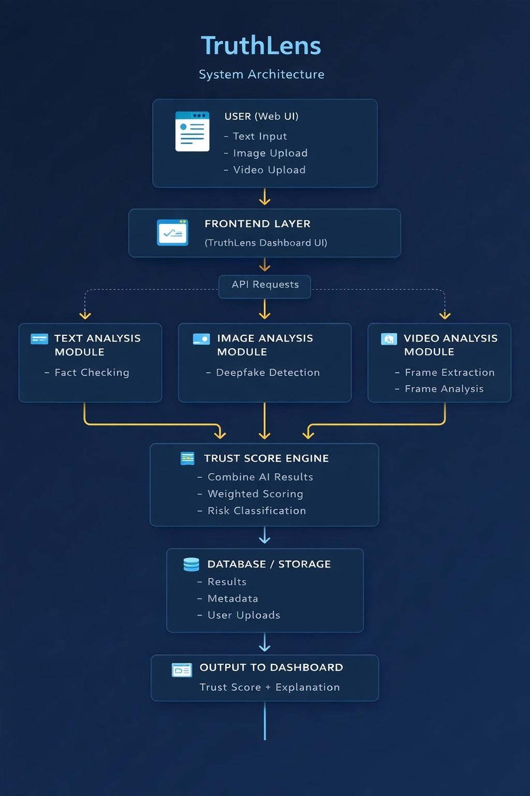
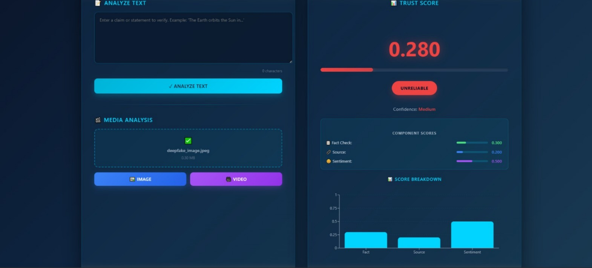

# 🛡️ TruthLens

### AI-Powered Digital Media Authenticity & Trust Score Engine

---

## 📌 Overview

**TruthLens** is an AI-powered media verification system designed to detect synthetic manipulation, deepfakes, and authenticity anomalies in digital content.

The system analyzes uploaded media using multiple forensic and AI-based detection modules and generates a **final Trust Score** that indicates the credibility of the content.

This project integrates:

* 🧠 Deepfake Detection
* 📷 Camera Fingerprint (PRNU) Analysis
* 🧾 Metadata Forensics
* 🤖 Synthetic Content Detection
* 🔄 Workflow Automation (n8n)
* 📊 React-based Dashboard

---

## 🏗️ Project Architecture

```
User Upload
     ↓
Backend (FastAPI / Python)
     ↓
AI Detection Modules
  - Deepfake Detection
  - PRNU Analysis
  - Metadata Analysis
  - Synthetic Detector
     ↓
Trust Score Engine
     ↓
React Frontend Dashboard
```
## ⚙️ Tech Stack

### 🔹 Backend

* Python
* FastAPI
* AI / ML models
* n8n workflow automation

### 🔹 Frontend

* React (Vite)
* Chart-based Trust Score visualization

### 🔹 DevOps

* Git & GitHub
* Ready for AWS deployment
* Modular microservice-ready design
## 🏗️ System Architecture

<p align="center">
  
</p>

---

## 🖥️ System View

<p align="center">
  
</p>

---

## 🔄 Workflow Diagram

<p align="center">
  
</p>
---
## 🚀 Installation & Setup

### 1️⃣ Clone Repository

```bash
git clone https://github.com/pallavikundapur23-hub/TruthLens.git
cd TruthLens
```

---

### 2️⃣ Backend Setup

```bash
cd backend
python -m venv venv
venv\Scripts\activate   # Windows
pip install -r requirements.txt
```

Run server:

```bash
python main.py
```

---

### 3️⃣ Frontend Setup

```bash
cd frontend
npm install
npm run dev
```

Frontend will run at:

```
http://localhost:5173
```

---

## 🧠 Core Modules

### 🔍 Deepfake Detection

Detects AI-generated or manipulated visual content using ML-based classification models.

### 📷 PRNU (Photo Response Non-Uniformity)

Analyzes sensor-level camera fingerprints to verify image authenticity.

### 🧾 Metadata Forensics

Extracts and evaluates metadata inconsistencies.

### 🤖 Synthetic Content Detector

Identifies AI-generated synthetic patterns in media files.

### 📊 Trust Score Engine

Aggregates outputs from all modules and calculates a final **Trust Score (0–100)**.

---

## 📡 API Endpoints

| Endpoint       | Method | Description                |
| -------------- | ------ | -------------------------- |
| `/verify`      | POST   | Analyze uploaded media     |
| `/final-score` | POST   | Generate final trust score |

---

## 🎯 Key Features

✔ Multi-layer forensic verification
✔ Modular AI services
✔ Scalable backend architecture
✔ Clean React dashboard UI
✔ Cloud-deployment ready


---

## 📈 Future Improvements

* Real-time streaming verification
* Blockchain-backed media authentication
* Explainable AI trust scoring
* Cloud-native deployment (AWS EC2 / Lambda)
* Database integration (AWS RDS)

---


